# MobileAppDev - Dự án Phát triển Ứng dụng Di động  

## 📱 Giới thiệu  
**MobileAppDev** là một dự án trong khuôn khổ môn học **Lập trình Di động** tại Trường Đại học Phenikaa. Dự án tập trung vào việc phát triển một ứng dụng di động nhằm giải quyết các vấn đề thực tế với thiết kế thân thiện và mang lại trải nghiệm người dùng tối ưu.  

Dự án được thực hiện bởi nhóm gồm 3 thành viên với sự hướng dẫn của **TS. Nguyễn Lệ Thu**.  

## 💡 Mục tiêu dự án  
- Ứng dụng kiến thức lập trình di động để xây dựng một sản phẩm thực tế.  
- Rèn luyện kỹ năng làm việc nhóm và quản lý dự án.  
- Hoàn thiện một sản phẩm có tính ứng dụng cao trên nền tảng di động.  

## 👥 Thành viên nhóm  
- **Vũ Quốc Việt** - 22010256  
- **Nguyễn Đức Quốc** - 22010234  
- **Nguyễn Văn Dương** - 22010019  

## 📂 Đề Tài
Xây dựng phần mềm quản lý chi tiêu cá nhân trên di động

## Mô tả Project
### Công nghệ sử dụng
- Ngôn ngữ lập trình: Dart
- Famework: Flutter

## Tính năng chính
- Đăng ký, đăng nhập, đăng xuất
- Quên mật khẩu, thay đổi mật khẩu
- Thêm, xóa chi tiêu
- Hiển thị danh sách chi tiêu
- Xem thống kê, báo cáo khoản chi tiêu theo biểu đồ và khoảng thời gian nhất định
- Thay đổi thông tin cá nhân

## Danh sách các màn hình

  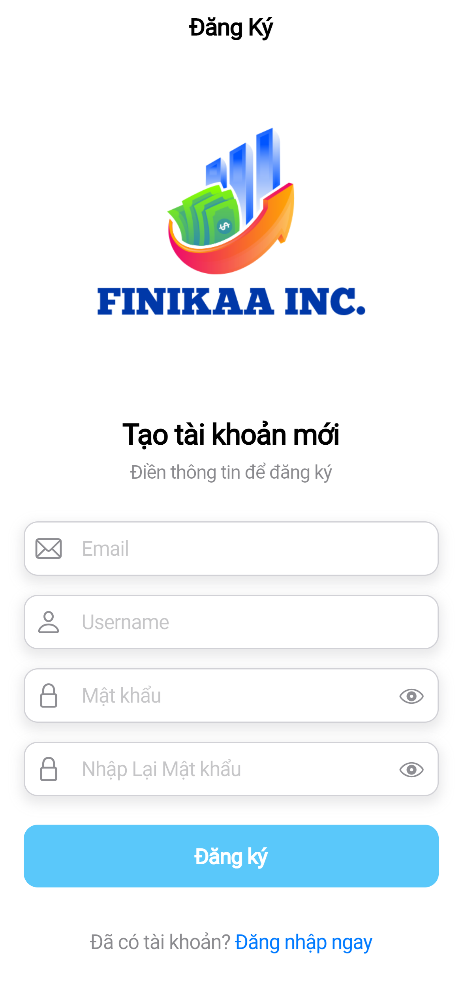
  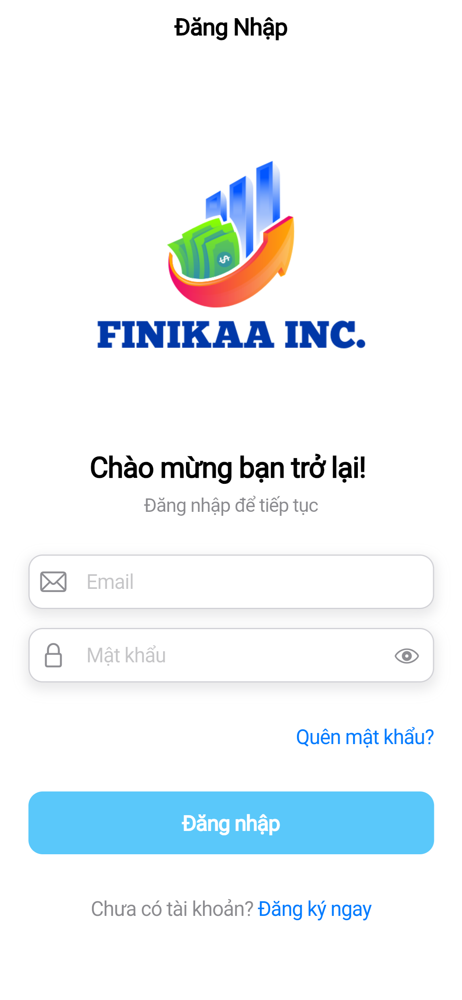
  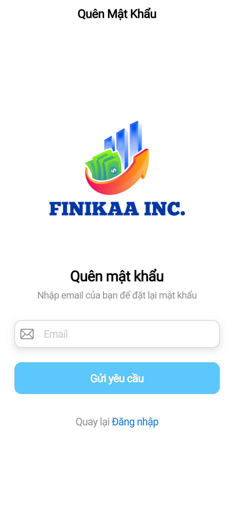
  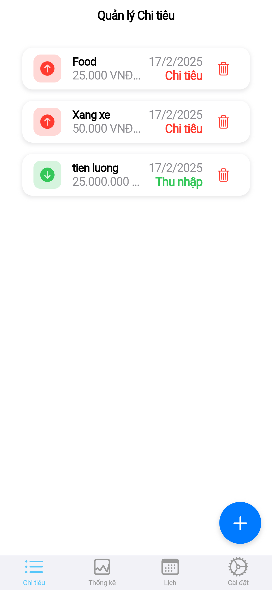
  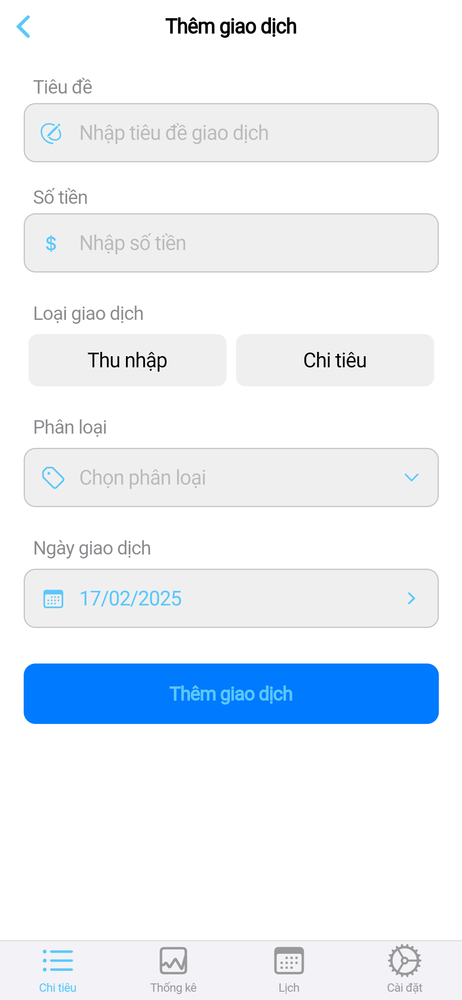
  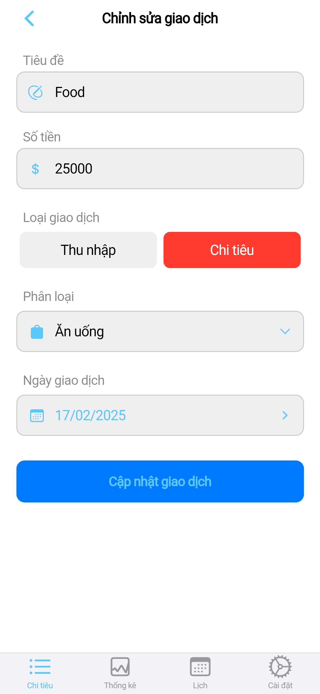
  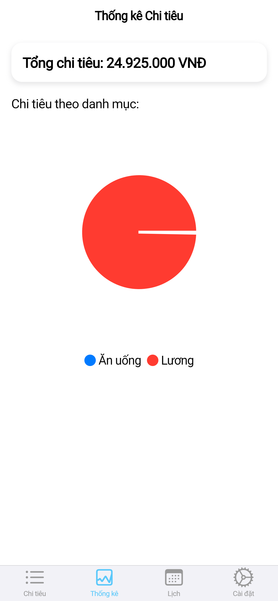
  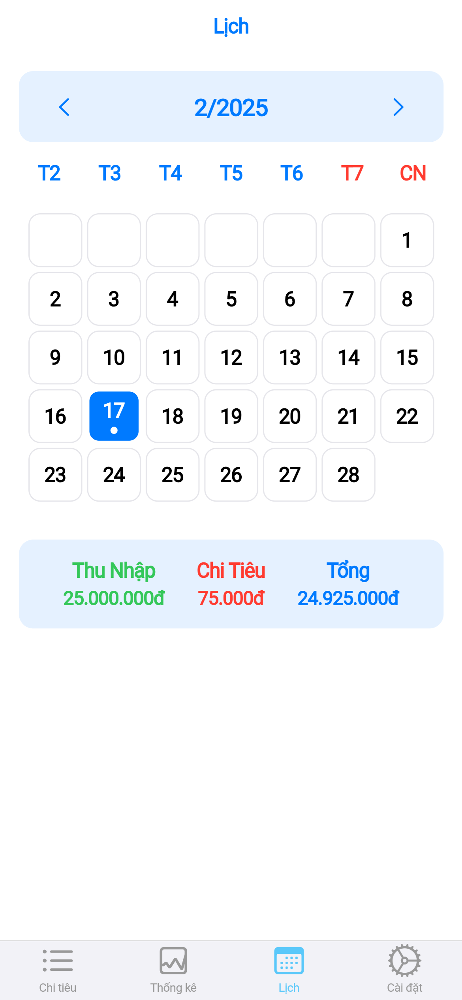
  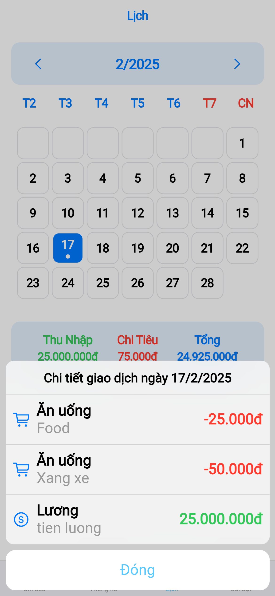
  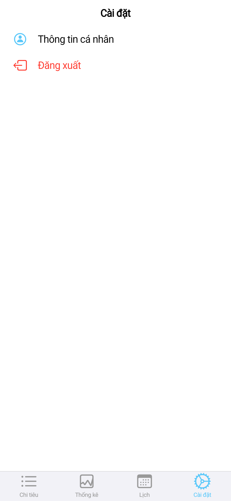

## Class Diagram
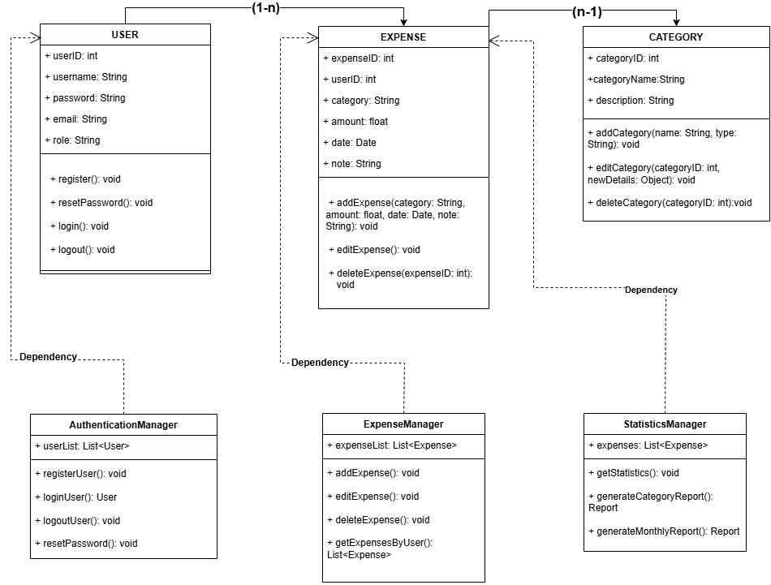

## Demo sơ đồ Use-case:
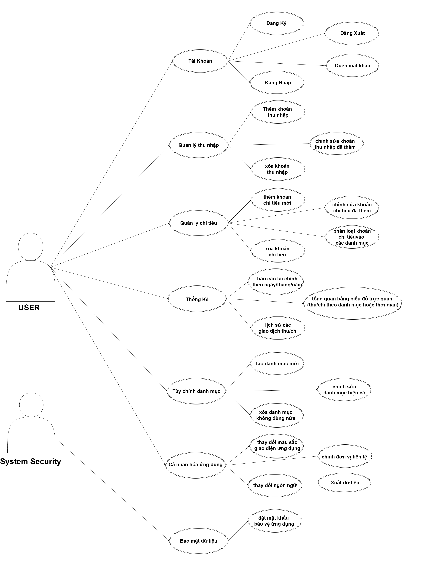

