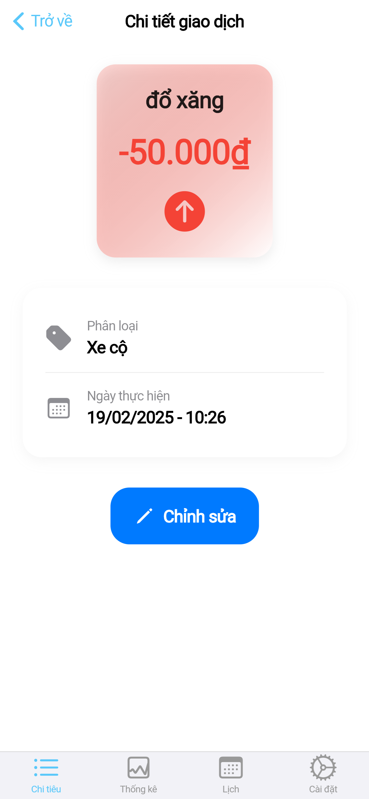
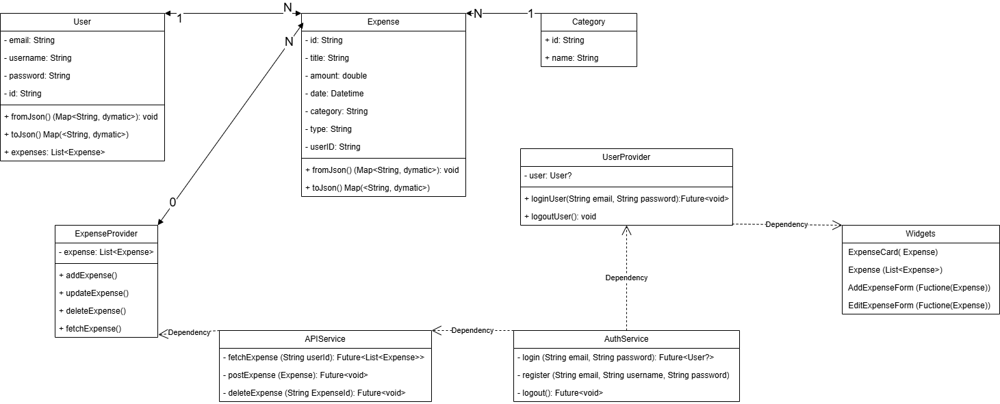
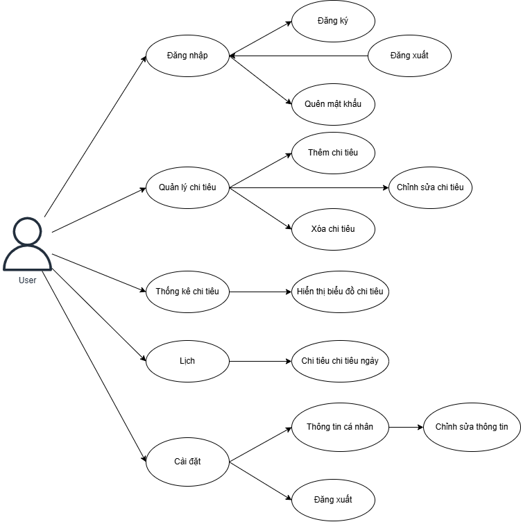

# MobileAppDev - Dự án Phát triển Ứng dụng Di động  

## 📱 Giới thiệu  
**MobileAppDev** là một dự án trong khuôn khổ môn học **Lập trình Di động** tại Trường Đại học Phenikaa. Dự án tập trung vào việc phát triển một ứng dụng di động nhằm giải quyết các vấn đề thực tế với thiết kế thân thiện và mang lại trải nghiệm người dùng tối ưu.  

Dự án được thực hiện bởi nhóm gồm 3 thành viên với sự hướng dẫn của **TS. Nguyễn Lệ Thu**.  

## 💡 Mục tiêu dự án  
- Ứng dụng kiến thức lập trình di động để xây dựng một sản phẩm thực tế.  
- Rèn luyện kỹ năng làm việc nhóm và quản lý dự án.  
- Hoàn thiện một sản phẩm có tính ứng dụng cao trên nền tảng di động.  

## 👥 Thành viên nhóm  
- **Vũ Quốc Việt** - 22010256  
- **Nguyễn Đức Quốc** - 22010234  
- **Nguyễn Văn Dương** - 22010019  

## 📌 Đề Tài
Xây dựng phần mềm quản lý chi tiêu cá nhân trên di động

## Mô tả Project
### Công nghệ sử dụng
- Ngôn ngữ lập trình: Dart
- Famework: Flutter

## 🎯Tính năng chính
- ✅ Đăng ký, đăng nhập, đăng xuất
- ✅ Quên mật khẩu, thay đổi mật khẩu
- ✅ Thêm, sửa, xóa chi tiêu
- ✅ Hiển thị danh sách chi tiêu
- ✅ Xem thống kê chi tiêu theo biểu đồ
- ✅ Xem thông tin chi tiêu các khoảng thời gian nhất định
- ✅ Thay đổi thông tin cá nhân

## Danh sách các màn hình
<p float = "left">
  
  
  
  
  
  
  
  
  
  
  

## Class Diagram


## Demo sơ đồ Use-case:


<!-- Giải thích sơ đồ Diagram -->
<!-- User → Expense: Một User có nhiều Expense (1-N). Một Expense thuộc về duy nhất một User (1-1) -->
<!-- ExpenseProvider → APIService: ExpenseProvider gọi APIService để lấy dữ liệu và chỉ sử dụng nó khi cần. -->
<!-- APIService → AuthService: APIService cần AuthService để xác thực người dùng trước khi gọi API. -->
<!-- UserProvider → AuthService: UserProvider lưu trạng thái đăng nhập, gọi AuthService để xác thực. -->
<!-- Widgets → Provider: Widgets như ExpenseList, ExpenseCard, AddExpenseForm chỉ lấy dữ liệu từ các Provider. -->

</p>

## 🛠 Cài đặt
### Yêu cầu hệ thống 
- Công nghệ: ngôn ngữ lập trình Dart và Famework Flutter
- API phát triển: Node.js và Express
- Cơ sở dữ liệu: MongoDB

### Cách cài đặt
1. Clone repo:
  ```bash
   git clone https://github.com/VietfromPKA/MobileAppDev_N05_GR06.git
   cd MobileAppDev_N05_GR06
  ```
2. Cài đặt dependencies:
  ```bash
  npm install
  ```

3. Vào thư mục quan_ly_chi_tieu\lib\services
  ```bash
  Để tìm địa chỉ IP ta vào cửa sổ dòng lệnh và gõ lệnh "ipconfig"
  Sao chép IP của dòng IPv4 Address
  Ta sửa IP tại dòng "final String baseUrl = 'http://10.6.136.115:3000';" trong cả 2 thư mục là "api_service.dart" và "auth_service.dart"
  ```

4. Chạy ứng dụng:
  ```bash
  node app.js
  flutter run
  ```
4. Mở ứng dụng trên trình giả lập hoặc thiết bị thật

## 📖 Hướng dẫn sử dụng
1. Đăng nhập hoặc đăng ký tài khoản 
2. Sử dụng các tính năng chính:
  - Người dùng chọn dấu <b>(+)</b> ở góc phải màn hình để thực hiện tính năng "<b>Thêm chi tiêu </b>"
  - Người dùng chọn mục chi tiêu bất kì, nhấn vào "<b>Chỉnh sửa</b>" để thực hiện chức năng "<b>Chỉnh sửa chi tiêu </b>"
  - Người dùng chọn icon "🗑️" ở màn hình chỉnh để thực hiện chức năng  "<b> Xóa chi tiêu </b>
  - Người dùng chọn mục "<b>Thống kê</b>" để xem "<b>Thống kê chi tiêu</b>"
  - Người dùng chọn mục "<b>Lịch</b> sau đó ấn vào một ngày bất kì để xem "<b>Thông tin chi tiêu ngày</b>".
  - Ở phần "<b>Cài đặt</b>" chọn mục "<b>Đăng xuất</b>" để thoát khỏi hệ thống và quay về màn hình <b>Đăng Nhập</b>.

## 📂 Cấu trúc thư mục
```
lib
├── models
│   ├── expense.dart
│   └── user.dart
├── providers
│   ├── auth_provider.dart
│   └── expense_provider.dart
├── screens
│   ├── authentication
│   │   ├── forgot_password_screen.dart
│   │   ├── login_screen.dart
│   │   └── register_screen.dart
│   ├── calendar
│   │   └── calendar_screen.dart
│   ├── expenses
│   │   ├── add_expense_screen.dart
│   │   ├── expense_detail_screen.dart
│   │   └── statistics_screen.dart
│   ├── settings
│   │   ├── profile_screen.dart
│   │   └── settings_screen.dart
│   └── home_screen.dart
├── services
│   ├── auth_service.dart
│   └── expense_service.dart
├── utils
│   ├── date_utils.dart
│   └── validation_utils.dart
├── widgets
│   ├── add_expense_form.dart
│   ├── edit_expense_form.dart
│   ├── expense_card.dart
│   └── expense_list.dart
└── main.dart
```
